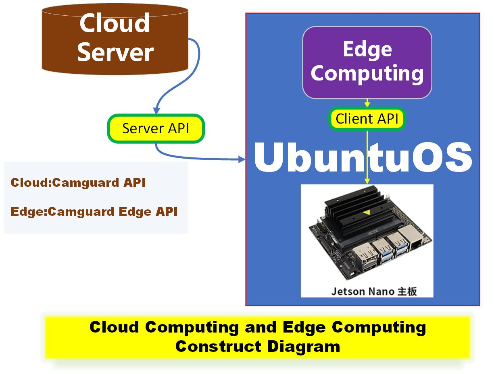

# AI GUARD 系統

## 簡述:

AI GUARD 系統 : 又稱為 DeviceConnector 設備鏈接器,是一款 基於 CCTV行業上的 AI 應用 與 IoT應用 的系統,主要考慮的場景是建築物的系統級別的AI, IoT上的應用,鏈接萬物,識別萬物,智能警報等等方向思考的一套系統. 由於比較行業性質的應用,設計界面力求簡單方向思考.

https://github.com/lawtatfaitony/DeviceConnector

目前掛載的獨立子系統包括:

1. 海康設備數據同步和聯連事件控制與警報
2. 安卓版的海康事件與數據同步
3. CIC(建造業議會)考勤拍卡數據雲端同步
4. Media.exe 錄像與直播系統的鏈接與媒體雲端轉錄(雲端安全備份)
5. MediaGuard V3 版本的 錄像數據同步與設備管理 https://github.com/lawtatfaitony/MediaGuardCmakeV3
6. ELV 弱電系統與管理 通過Orange PI GPIO 實現對電路管理控制,也可以遠端遠程控制.

開發日誌 DeviceConnector/tree/main/NetCamGuardNew95/readme.md

## CLOUD And Edge Device 

雲端 與 邊緣設備 願景

​							這只是早期圖片草圖 只表達CLOUD 與 EDGE 關係

目前 OrangePI AI PRO 更強大更適合邊緣AI計算

### 雲端與邊緣設備概覽

​	實現雲端/LAN 佈局下,控制跨樓宇的屋苑物業的ELV系統/CCTV系統控制/AI智能警報.

#### 	ELV系統

​		ELV弱電控制 通過 雲端>邊緣設備>感應設備 等等模式,實現IoT系統的萬物互聯的最佳解決方案.

#### 	CCTV系統 

​		引入新的監控模式: AI 智能警報,減少人力資源,降低營運成本.

#### 	 AI 識別與警報 

​		智能算法 處理的結果, 最後如果落地,具體表現,得需要通過ELV弱電系統實現對感應器的控制.

## AI 識別與警報與ELV 感應器 
